# Profiler
This is a tool for measuring execution time of certain parts of your C++ code.

The profiler measures the time spent in the scope where it is used. It can be used in a function, a loop, or any other block of code.

# Integration
To integrate the profiler into your C++ project, it is suggested to use github submodules or cmake fetchcontent.
### Using Git Submodules
To add the profiler as a submodule, run the following command in your project directory:

```bash
git submodule add git@github.com:Pippo98/profiling profiler
```
### Using CMake FetchContent
If you are using CMake, you can add the profiler to your project using the `FetchContent` module. Add the following lines to your `CMakeLists.txt` file:
```cmake
include(FetchContent)
FetchContent_Declare(
    profiling
    GIT_REPOSITORY https://github.com/Pippo98/profiling.git
    GIT_TAG main
)
FetchContent_MakeAvailable(profiling)
```

## Compiling the Profiler
After adding the profiler to your project, you need to compile it. If you are using CMake, you can do this by adding the following line to your `CMakeLists.txt`:
```cmake
add_subdirectory(profiler)
```

Some options are available to customize the compilation tergets:
```cmake
# These options are optional and can be set to OFF if you do not need them.
# Are in fact default to ON.
set(PROFILER_BUILD_GUI OFF)
set(PROFILER_BUILD_TESTS OFF)
```

The main library target is `profiler`, which you can link to your project using:
```cmake
target_link_libraries(your_target_name PRIVATE profiler)
```

## Enabling Profiling
To enable profiling in your code, you need to define the `PROFILING_ENABLED` macro before including the profiler header file. You can do this by adding the following line to your code:
```cpp
#define PROFILING_ENABLED
```
or by passing the `-DPROFILING_ENABLED` flag to your compiler.
or by adding the following line to your `CMakeLists.txt`:
```cmake
add_definitions(-DPROFILING_ENABLED)
```

Without this macro defined, the profiler will not compile any code, and it will be as if the profiler is not present in your project. This is useful for disabling profiling in production builds or when you do not need profiling.

# Usage
To use the profiler, include the header file in your C++ code:

```cpp
#include "profiler/profiler.h"
```

Then you have to initialize and enable the profiling session. This can be done by calling:
```cpp
ProfilingSession::getGlobalInstace().initialize(<your_output_path>/);
ProfilingSession::getGlobalInstace().enable();
```
You can do this in your `main` function or at the beginning of your program. The output path is where the profiler will save the profiling data.
You can also use the `ProfilingSession::getGlobalInstace().disable()` method to stop the profiling session when you are done.

The output files are two, one contains the raw measurements in a binary format, and the other contains some mappings used to parse the binary data.
Since the output is in binary format, you will need to use the profiler GUI to visualize the data. The GUI can be built by setting the `PROFILER_BUILD_GUI` option to `ON` when compiling the profiler.


Then, you can use the `MEASURE_SCOPE` macro to measure the execution time of a block of code. For example:

```cpp
void myFunction() {
    MEASURE_SCOPE(scope1);
    // Your code here
    MEASURE_SCOPE(scope2);
    for (int i = 0; i < 1000; ++i) {
        MEASURE_SCOPE(loop_iteration);
        // Your code here
    }
}
```

The `MEASURE_SCOPE` macro takes a single argument, which is the name of the instance of a measurement element. This name will also be used to identify the measurement in the profiler output.

# GUI
The profiler GUI is a tool for visualizing and exporting the profiling data.

First open the GUI by executing `./bin/plotter` in the profiler source directory.
Then you can insert the path to the same path you used to initialize the profiling session in your code.

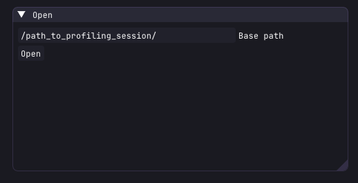

Then it will first load the data:

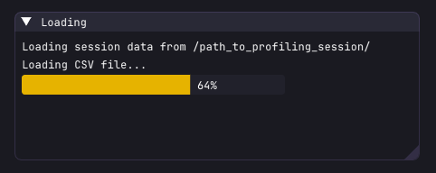

And then it will process the data:

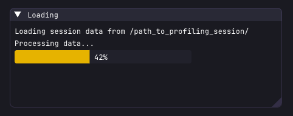

The GUI is formed by two tabs: the "Timeline" and the "Statistics". Both can be moved, resized (bottom right edge) and docked (by dragging the title bar) to your liking.

## Timeline
The timeline tab shows the execution time of each measurement in a timeline format. You can zoom in and out using the mouse wheel, you can also use the arrows to move horizontally (press and hold shift to increase the speed, or press and hold ctrl to decrease the speed).

You can hover on a measurement to see the details, such as the name, the start time, the end time, and the duration.
You can also press Enter when hovering on a measurement to open the file where the measurement was taken, if available.

The timeline can show visual gitches, this is normal and is due to the fact that the view is not zoomed in enough to show the measurements correctly. You can zoom in to see the measurements more clearly.

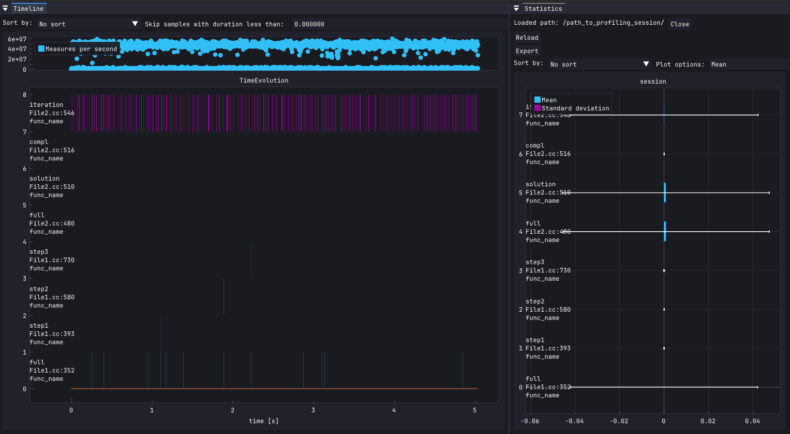

Without glitches the timeline looks like this:

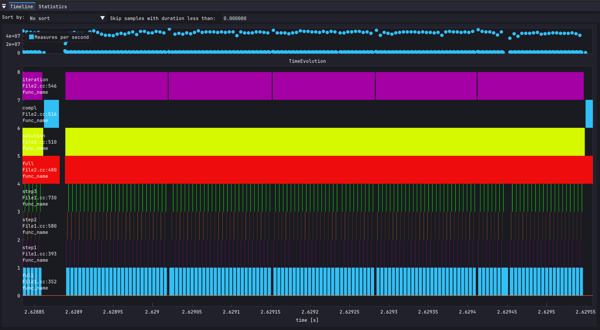

Also you can sort the rows by clicking on the dropdown menu on the top left corner of the timeline tab.  
You can sort by appearance time or total duration.

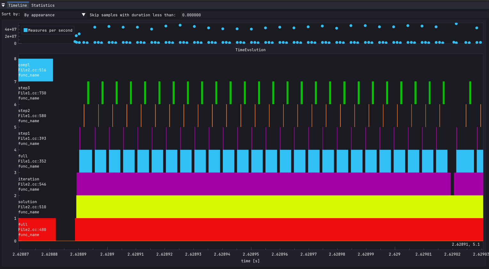


## Statistics
> Temporarily, the statistics tab contains options to close the session, reload the data, and export the data to a CSV file. It will be moved to a separate and more appropriate place in the future.

The statistics tab shows in different ways a summary for each measurement point. The options are:
- **Mean**: the average duration of the measurement.
- **Cumulative**: the total duration of the measurement.
- **Percentage**: the percentage of the total duration of the measurement compared to the total duration of all measurements.
- **Counts**: the number of times the measurement was taken.
- **Frequency**: the frequency of the measurement, calculated as the number of times the measurement was taken divided by the total duration of all measurements.

Here a screenshot of every option:

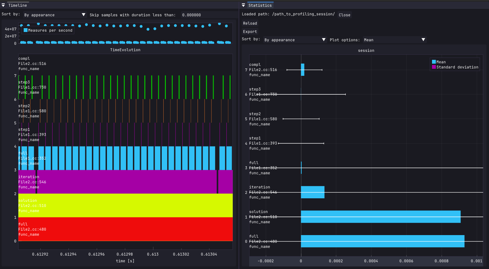
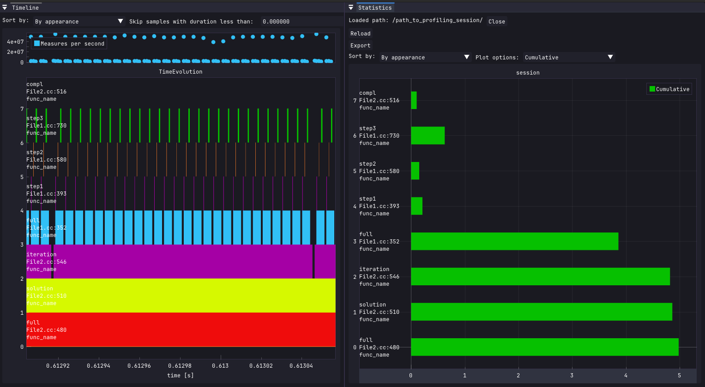
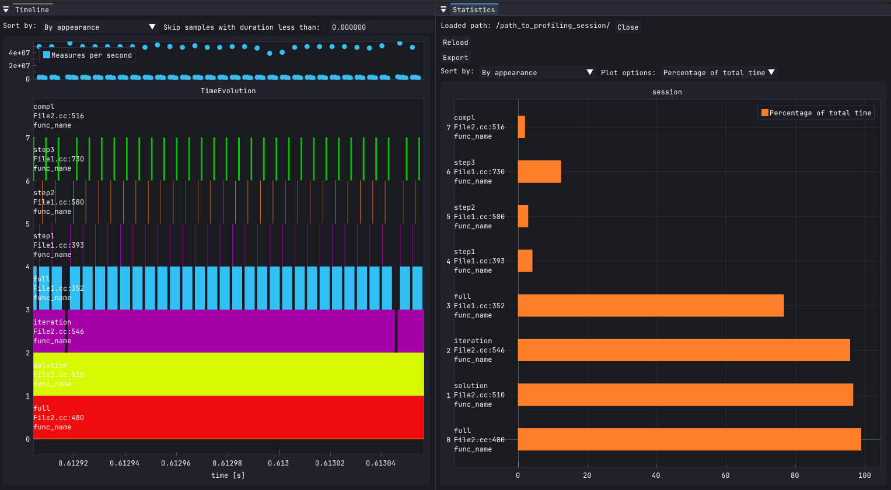
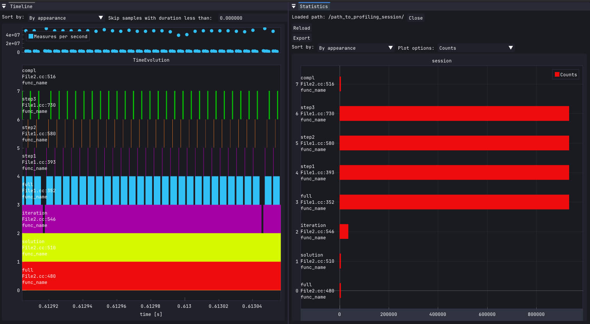
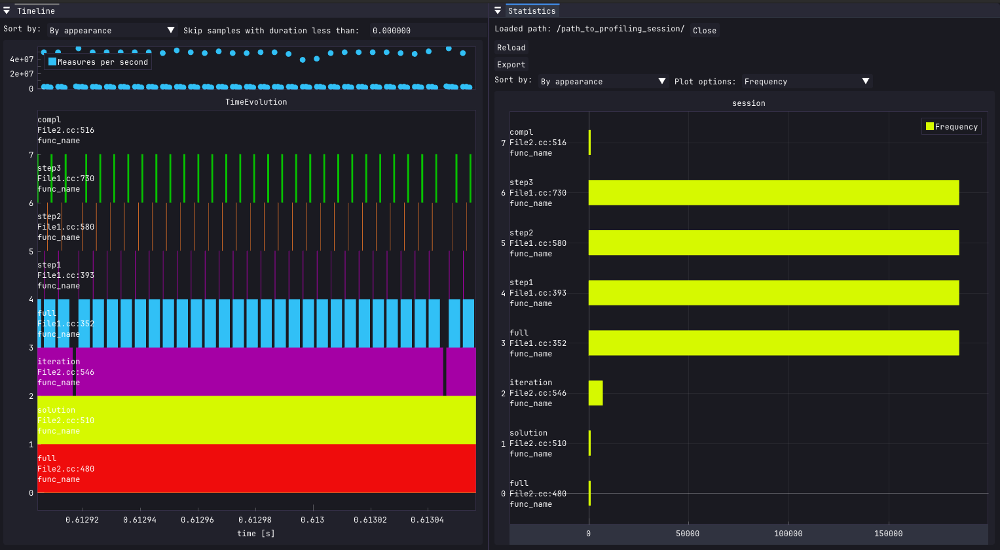

## Exporting Data
You can export the data to a CSV file by clicking on the "Export" button in the statistics tab.  
A dialog will appear asking you to choose the output file prefix.  
The exported files are two. One will contain the raw measurements in a CSV format, and the other will contain the statistics in a CSV format.

The exported_session.csv file will contain the following columns:
- `time`: the time of the measurement in nanoseconds.
- `duration`: the duration in nanoseconds.
- `path`: the path of the file where the measurement was taken.
- `line`: the line number in the source file.
- `function`: the name of the function where the measurement was taken.
- `name`: the name of the measurement.

The exported_stats.csv file will contain the following columns:
- `name`: the name of the measurement.
- `function`: the name of the function where the measurement was taken.
- `file`: the path of the file where the measurement was taken.
- `line`: the line number in the source file.
- `mean duration`: the mean duration of the measurement in nanoseconds.
- `standard deviation`: the standard deviation of the duration of the measurement in nanoseconds.
- `mean frequency`: the mean frequency of the measurement in Hz.
- `hits`: the number of times the measurement was taken.

